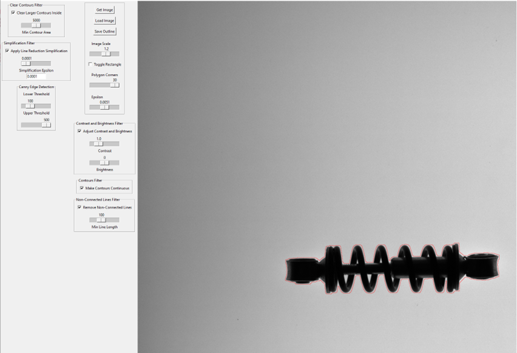

*This is a template repository for this organization. Start by replacing the placeholder for the project name with its actual title.*

# [Demonstration Project title]

## Summary
| Company Name | [Company](https://website.link) |
| :--- | :--- |
| Development Team Lead Name | [Dr. John Smith](https://profile.link) |
| Development Team Lead E-mail | [email@example.com](mailto:email@example.com) |
| Duration of the Demonstration Project | month/year-month/year |
| Final Report | [Example_report.pdf](https://github.com/ai-robotics-estonia/_project_template_/files/13800685/IC-One-Page-Project-Status-Report-10673_PDF.pdf) |

### Each project has an alternative for documentation
1. Fill in the [description](#description) directly in the README below *OR*;
2. make a [custom agreement with the AIRE team](#custom-agreement-with-the-AIRE-team).

# Description
## Objectives of the Demonstration Project
*Please describe your project objectives in detail.*

Lorem ipsum dolor sit amet, consectetur adipiscing elit, sed do eiusmod tempor incididunt ut labore et dolore magna aliqua. Ut enim ad minim veniam, quis nostrud exercitation ullamco laboris nisi ut aliquip ex ea commodo consequat. Duis aute irure dolor in reprehenderit in voluptate velit esse cillum dolore eu fugiat nulla pariatur. Excepteur sint occaecat cupidatat non proident, sunt in culpa qui officia deserunt mollit anim id est laborum.

## Activities and Results of the Demonstration Project
### Challenge
*Please describe challenge addressed (i.e, whether and how the initial challenge was changed during the project, for which investment the demonstration project was provided).*

Lorem ipsum dolor sit amet, consectetur adipiscing elit, sed do eiusmod tempor incididunt ut labore et dolore magna aliqua. Ut enim ad minim veniam, quis nostrud exercitation ullamco laboris nisi ut aliquip ex ea commodo consequat. Duis aute irure dolor in reprehenderit in voluptate velit esse cillum dolore eu fugiat nulla pariatur. Excepteur sint occaecat cupidatat non proident, sunt in culpa qui officia deserunt mollit anim id est laborum.

### Data Sources
*Please describe which data was used for the technological solution.*  
- [Source 1],
- [Source 2],
- etc... .

### AI Technologies
*Please describe and justify the use of selected AI technologies.*
- [AI technology 1],
- [AI technology 2],
- etc... .

### Technological Results
*Please describe the results of testing and validating the technological solution.*

Lorem ipsum dolor sit amet, consectetur adipiscing elit, sed do eiusmod tempor incididunt ut labore et dolore magna aliqua. Ut enim ad minim veniam, quis nostrud exercitation ullamco laboris nisi ut aliquip ex ea commodo consequat. Duis aute irure dolor in reprehenderit in voluptate velit esse cillum dolore eu fugiat nulla pariatur. Excepteur sint occaecat cupidatat non proident, sunt in culpa qui officia deserunt mollit anim id est laborum.

### Technical Architecture
*Please describe the technical architecture (e.g, presented graphically, where the technical solution integration with the existing system can also be seen).*
- [Component 1],
- [Component 2], 
- etc... .

### User Interface 
*Please describe the details about the user interface(i.e, how does the client 'see' the technical result, whether a separate user interface was developed, command line script was developed, was it validated as an experiment, can the results be seen in ERP or are they integrated into work process)*

The user interface for the system was designed using Tinkercad library to provide a clear and intuitive way for clients to interact with the contour detection process and access the generated technical results. The approach taken was based on the specific use case and integration needs:

Capture an image of the object using an integrated camera system. Set the camera parameters, scaling, and crop the image.
View real-time contour extraction results using edge detection and contour simplification techniques.
Adjust processing parameters, such as sensitivity, scaling, thresholding, and contour filtering, to fine-tune the output. Contourline can be optimized by amount of conrners, line shape sensitivity, consistency, removal of unconnected lines.
Export results as a DXF file, which can be used in CNC machining or other automated processes.

The UI was validated through experimental testing, where users interacted with the system to assess usability and workflow efficiency. Feedback was used to refine the interface, ensuring an intuitive experience with minimal manual intervention.

### Future Potential of the Technical Solution
*Please describe the potential areas for future use of the technical solution.*
- [Use case 1],
- [Use case 2],
- etc... .

### Lessons Learned

Testing and validation have provided key insights into the effectiveness of different approaches for contour detection and DXF generation. One major takeaway is that a four-camera system with fixed positions does not justify its complexity. The challenges in mechanical alignment and synchronization outweigh the potential benefits, making a single-camera setup with optimized parameters the more efficient solution.

Another important finding is that software-based distortion correction alone is not sufficient to ensure the required level of accuracy. While computational methods can compensate for some optical distortions, they do not provide the precision necessary for high-accuracy applications. This highlights the critical importance of selecting the right optical components, as proper lens choices play a fundamental role in achieving accurate contour detection.

Finally, despite these challenges, the overall methodology has proven to be effective in solving the problem. The approach of using machine vision for automated contour extraction and DXF output is viable, and with continued refinements in optical selection and calibration, the system can achieve even higher precision and reliability.

# Custom agreement with the AIRE team
*If you have a unique project or specific requirements that don't fit neatly into the Docker file or description template options, we welcome custom agreements with our AIRE team. This option allows flexibility in collaborating with us to ensure your project's needs are met effectively.*

*To explore this option, please contact our demonstration projects service manager via katre.eljas@taltech.ee with the subject line "Demonstration Project Custom Agreement Request - [Your Project Name]." In your email, briefly describe your project and your specific documentation or collaboration needs. Our team will promptly respond to initiate a conversation about tailoring a solution that aligns with your project goals.*
