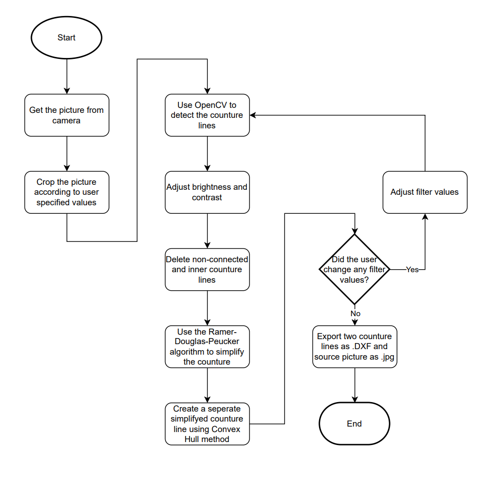

# Automation of 2D Product Scanning – Shadow Line Detection and Device Testing

## Summary
| Company Name | Ages Partner OÜ |
| :--- | :--- |
| Development Team Lead Name | Alar Niidas |
| Development Team Lead E-mail | [alar.niidas@taltech.ee](mailto:alar.niidas@taltech.ee) |
| Duration of the Demonstration Project | 06.2024 - 02.2025 |
| Final Report | [Example_report.pdf](https://github.com/ai-robotics-estonia/_project_template_/files/13800685/IC-One-Page-Project-Status-Report-10673_PDF.pdf) |

# Description
## Objectives of the Demonstration Project

The aim of the project is to test a cost-effective device concept that automates the preparatory design stage of production. The device would help reduce the amount of manual work and decrease the time required to obtain the shadow outline of packaged products/equipment. Additionally, it would improve work quality by enhancing the accuracy of results. 

The 2D scanning/shadow outline detection of a product or component is currently a manual and time-consuming process, and no suitable devices are available on the market to simplify and automate this process.The need for a device that speeds up and simplifies this task extends across various industries, creating opportunities to commercialize the validated device. 

## Activities and Results of the Demonstration Project
### Challenge

The company's production capacity has significantly improved over time, largely due to the adoption of CNC machines. However, there is still considerable potential to enhance internal processes through digitalization, allowing for the service of an even larger customer base. Currently, a major bottleneck in production is the preparation phase, where excessive time is spent on technical documentation and measuring customer products. Automating this process would lead to a significant breakthrough in increasing production throughput and reducing delivery times for customers. 

A foam plastic sheet is cut on a CNC milling machine to create a precise cavity that matches the shape of the packaged product. To generate the CNC machining program for this cavity, the product’s projection/shadow outline must be obtained. 

At present, no suitable devices are available on the market for this specific purpose. Existing scanning solutions generate large data volumes with excessive unnecessary information, making the process time-consuming and expensive. Photography-based approaches introduce distortions, and some parts of the packaged product may remain hidden. Light projection methods also cause shape distortions. 

The accuracy and speed of detecting the shadow outline of packaged products/equipment are crucial for creating precise and cost-effective transport cases. Currently, the 2D scanning/shadow outline detection process is manual and time-consuming, and no suitable devices exist on the market to simplify and automate it. 

The goal of the project is to automatically generate and validate a DXF drawing that can be directly used as a CNC machine command. This solution will also eliminate the time-consuming step of preparing technical documentation. 

### Data Sources

- 2D Image Data (Basler Cameras via Pypylon)

### AI Technologies

- Edge Detection Algorithms (OpenCV Canny Edge),
- Lighting and Contrast Optimization Parameters,
- Ramer-Douglas-Peucker Algorithm,
- Convex Hull Algorithm,
- Contour Refinement and Noise Removal

Using AI for contour line optimization and DXF output is highly justified due to its ability to automate, enhance accuracy, and improve efficiency in contour detection and vectorization. 

One of the primary advantages of AI is automation and speed. Traditional methods, such as manual tracing or CAD software, are time-consuming and labor-intensive. AI-driven contour detection automates the process, significantly reducing the time required for shape extraction and DXF conversion. Additionally, AI ensures improved accuracy and precision by eliminating noise, handling complex edges, and producing smoother contours compared to conventional image processing methods. Advanced machine learning models can also correct distortions and improve the quality of extracted outlines. 

AI is particularly effective at handling complex shapes, making it ideal for irregular and organic forms. Unlike traditional methods, AI can differentiate between overlapping objects, shadows, and reflections, ensuring precise contour extraction. Furthermore, adaptive learning and optimization allow AI to improve over time by learning from past datasets, refining contour detection, and reducing errors. This also helps in optimizing line smoothing, minimizing unnecessary anchor points, and enhancing shape fidelity for better CNC processing. 

Another key advantage is noise reduction and error handling. AI can intelligently fill gaps, filter out irrelevant details, and ensure cleaner output even in challenging conditions such as incomplete edges, occlusions, or low-contrast images. Additionally, AI-driven systems can directly export DXF files for CNC and CAD applications, eliminating the need for additional CAD software steps. This ensures efficient vectorization, minimizes redundant nodes, and optimizes paths for CNC cutting. 

Beyond technical benefits, AI-based contour detection is highly scalable and versatile, capable of processing large batches of images quickly, making it ideal for industrial applications. Its applicability spans various industries, including manufacturing, packaging, medical imaging, and automation. By reducing human intervention and labor costs, AI also makes contour detection more cost-effective while allowing for 24/7 operation, increasing overall productivity. 

### Technological Results

Testing has shown that the measurement accuracy of a single-camera system is approaching the required limits for objects up to 100 mm in height. While further refinements may be needed, initial results indicate that a single-camera setup can provide sufficient precision for contour detection. This suggests that additional optimization could help meet exact industrial requirements without the need for more complex configurations. 

The choice of optical components, particularly in terms of lens distortion and focal length optimization, plays a crucial role in system performance. Testing has provided valuable insights into how different lens parameters affect accuracy. By fine-tuning optical properties, it is possible to minimize geometric distortions and enhance the reliability of the extracted contours. 

A multi-camera setup, specifically a four-camera system, was evaluated but found to be unjustified compared to a single-camera approach. The mechanical complexity of aligning and synchronizing multiple cameras would require precise movement coordination, making the system overly intricate. Given these challenges, a well-calibrated single-camera setup was determined to be the more efficient and practical solution, offering similar results with significantly reduced complexity. 

The brightness of the light box was tested up to a distance of 1290 mm, and results confirmed that illumination levels remain sufficient for accurate contour detection. The uniform lighting minimizes shadow interference and enhances the clarity of object edges, contributing to more precise contour extraction. These findings validate that the lighting conditions are well-suited for high-accuracy imaging within the tested range.

In conclusion, the single-camera approach proves to be both effective and practical, provided that optical parameters are carefully optimized. The multi-camera system does not offer significant advantages, given the challenges in mechanical alignment and synchronization. Additionally, the lighting setup is sufficient for maintaining accuracy at extended distances. These results guide further refinements in optical calibration and software processing, ensuring continuous improvements in system performance. 

### Technical Architecture

Below is presented a flowchart of how to overall proccess of how the final solution works.

### User Interface 

The user interface for the system was designed using Tinkercad library to provide a clear and intuitive way for clients to interact with the contour detection process and access the generated technical results. The approach taken was based on the specific use case and integration needs:

Capture an image of the object using an integrated camera system. Set the camera parameters, scaling, and crop the image.
View real-time contour extraction results using edge detection and contour simplification techniques.
Adjust processing parameters, such as sensitivity, scaling, thresholding, and contour filtering, to fine-tune the output. Contourline can be optimized by amount of conrners, line shape sensitivity, consistency, removal of unconnected lines.
Export results as a DXF file, which can be used in CNC machining or other automated processes.

The UI was validated through experimental testing, where users interacted with the system to assess usability and workflow efficiency. Feedback was used to refine the interface, ensuring an intuitive experience with minimal manual intervention.

### Future Potential of the Technical Solution

This machine learning and computer vision solution is unique, and the developed device has market potential. In addition to optimizing production processes, the device also creates an opportunity to tap into a new market by selling the system itself.

A similar shadow outline extraction method can be applied in photo editing, object recognition, and product inspection. The use in quality control of complicated parts is also an opportunity, such as identifying defects by comparing contours to reference models.

The most straightforward use is in the same field of safety case production. Industry at its current state uses mainly manual work to produce contourlines of products and parts.

Additional uses can include robotics and automation. In object recognition and grasping the solution can be used to  assists robotic arms in identifying and picking objects in assembly lines. Autonomous robots could detect and avoid obstacles using contour analysis.

  
### Lessons Learned

Testing and validation have provided key insights into the effectiveness of different approaches for contour detection and DXF generation. One major takeaway is that a four-camera system with fixed positions does not justify its complexity. The challenges in mechanical alignment and synchronization outweigh the potential benefits, making a single-camera setup with optimized parameters the more efficient solution. 

Another important finding is that software-based distortion correction alone is not sufficient to ensure the required level of accuracy. While computational methods can compensate for some optical distortions, they do not provide the precision necessary for high-accuracy applications. This highlights the critical importance of selecting the right optical components, as proper lens choices play a fundamental role in achieving accurate contour detection. 

Finally, despite these challenges, the overall methodology has proven to be effective in solving the problem. The approach of using machine vision for automated contour extraction and DXF output is viable, and with continued refinements in optical selection and calibration, the system can achieve even higher precision and reliability. 

    
